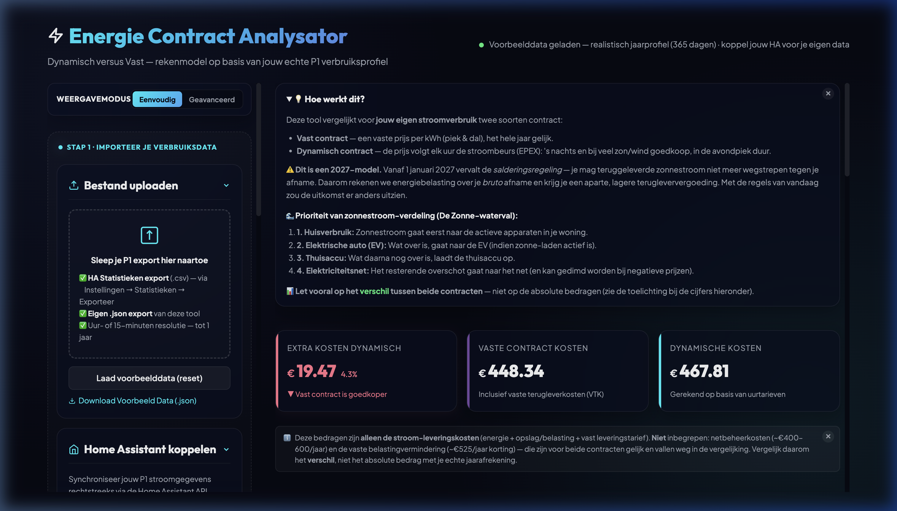
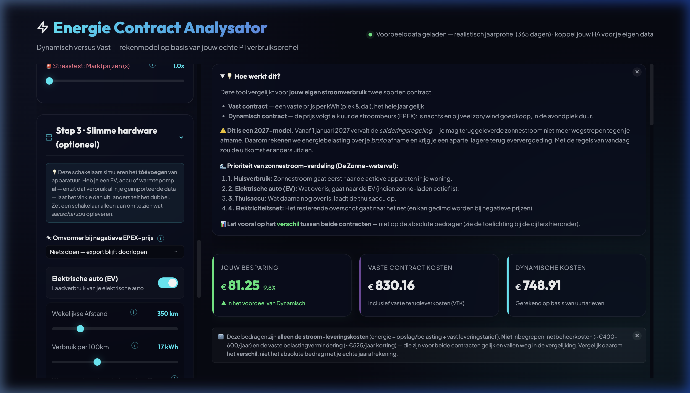
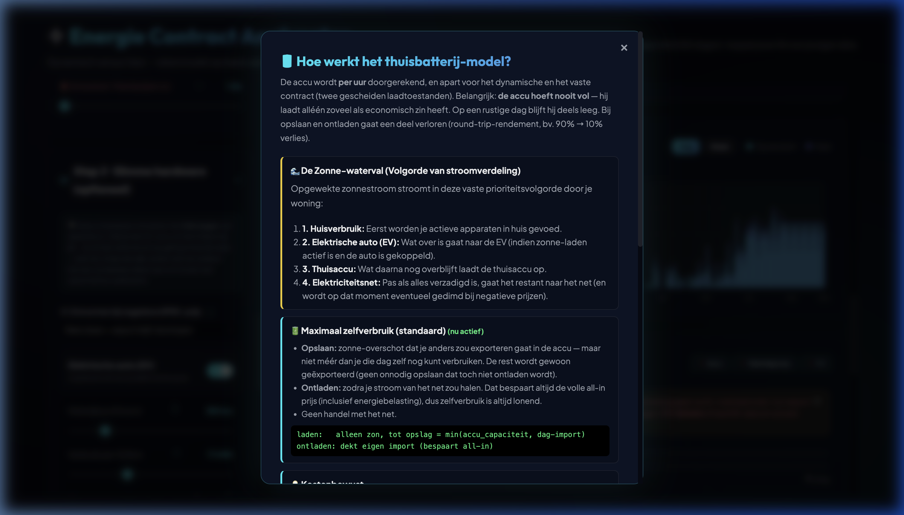
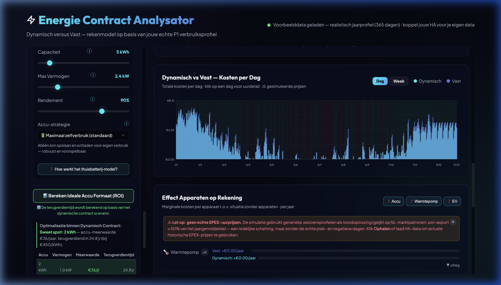

# P1 Energie Contract Analysator

Bereken of een **dynamisch** of **vast** energiecontract goedkoper is voor jouw situatie — op basis van je eigen P1 smart meter data uit Home Assistant, gerekend met de **fiscale regels van 2027** (einde saldering, energiebelasting over bruto afname).

## Screenshots & Demonstratie

### Werking van de app (animatie)


### Weergaven (Eenvoudig vs. Geavanceerd)
| Eenvoudige weergave (Standaard) | Geavanceerde weergave |
|---|---|
|  |  |

### Slimme functionaliteiten
| Thuisbatterij model (uitleg en wiskunde) | Sweet Spot Finder (ROI) |
|---|---|
|  |  |

## Wat doet het?

- **Progressieve Onthulling (Progressive Disclosure)** — de app start standaard in een eenvoudige weergave (alleen P1-upload en basistarieven). Geavanceerde hardware-simulaties (EV, batterij, warmtepomp, dimmen) en de stresstest zijn met één klik op de toggle 'Geavanceerd' te activeren.
- **Koppelt met Home Assistant** via de WebSocket-API om tot ~2 jaar historische P1-data op te halen (of upload een CSV/JSON-export — meerdere bestanden worden samengevoegd en ontdubbeld).
- **Vergelijkt vast vs. dynamisch** met het 2027-model:
  - **Vast** — piek/dal-tarieven, teruglevertarief, Vaste Terugleverkosten (VTK), vastrecht.
  - **Dynamisch** — EPEX-uurprijzen (Frank Energie / EnergyZero) + opslag + energiebelasting over **bruto** afname.
- **De Zonne-waterval** — verduidelijkt hoe de opgewekte zonnestroom verdeeld wordt (eerst Huisverbruik, dan EV, dan Thuisaccu, en ten slotte het Net).
- **Jaarprognose** — heb je minder dan een jaar data? Een slim seizoensprofiel vult de ontbrekende maanden aan tot een volledig, realistisch jaarverbruik (winter zwaarder, zomer lichter, avondpiek voor koken/verlichting).
- **Hardware-simulaties** — warmtepomp, elektrische auto (thuis/forens), thuisbatterij (zelfconsumptie óf netarbitrage), zonnepanelen dimmen bij negatieve prijzen.
- **Sweet Spot Finder** — berekent automatisch het ideale accuformaat met terugverdientijd (met duidelijke disclaimers over optimalisatie binnen het dynamische contract).
- **Stresstest** — vermenigvuldig de marktprijzen om te zien of dynamisch ook in een energiecrisis nog loont.
- **Formules in mensentaal** — de wiskundige modellen en formules (rendementen, laadbudgetten, etc.) worden in duidelijke, begrijpelijke termen uitgelegd in de hardware explainer modals.
- **Grafieken** — 24-uurs dagprofiel, dag/week-overzicht, maandelijkse kostenvergelijking en hardware-effect per apparaat.

## Het 2027-model (einde saldering)

Vanaf **1 januari 2027** vervalt de salderingsregeling. De app rekent hier al volledig mee:

- **Energiebelasting (EB)** wordt geheven over de **bruto afname** van het net — niet meer netto na aftrek van teruglevering.
- **Geen saldering**: teruggeleverde stroom verlaagt je EB-grondslag niet meer; je krijgt er enkel het (lage) teruglevertarief voor, minus eventuele VTK.
- Daardoor is **zonnepanelen dimmen** bij negatieve EPEX-prijzen eerder voordelig dan onder saldering.

> ⚠️ Het exacte **EB-tarief voor 2027 is nog niet vastgesteld** (verwacht op Prinsjesdag, september 2026). De standaardwaarde is een 2026-benadering (~11,1 ct/kWh) en is in de app instelbaar. Alle bedragen zijn indicatief — controleer altijd je eigen contract.

## Snel starten

Puur HTML/CSS/JavaScript — geen build-stap, geen database, geen tracking.

> **Belangrijk:** de pagina laadt `app.js` en `style.css` onder het pad-prefix **`/energie/`** (productie-deploy). Serveer de app daarom onder dat subpad — zie hieronder.

### Lokaal draaien

Serveer de map onder `/energie/`, bijvoorbeeld met een symlink + statische server:

```bash
# vanuit de projectmap
ln -sfn . energie                 # maakt /energie/ → projectmap
python3 -m http.server 8080
# open http://localhost:8080/energie/
```

Of plaats de bestanden in een map `energie/` achter je webserver.

> Een directe `file://`-opening werkt niet: de Home Assistant-koppeling vereist een HTTP-origin (CORS), en de `/energie/`-paden zijn absoluut.

### Productie (nginx)

Serveer de statische bestanden onder `/energie/` en sta CORS toe vanaf die origin voor je HA-locatie:

```nginx
# De app zelf (statische bestanden)
location /energie/ {
    alias /var/www/p1-analysator/;   # map met index.html, app.js, style.css
    try_files $uri $uri/ /energie/index.html;
}

# CORS voor de Home Assistant-API (in het HA location-blok)
add_header Access-Control-Allow-Origin "https://jouwdomein.nl" always;
add_header Access-Control-Allow-Methods "GET, POST, OPTIONS" always;
add_header Access-Control-Allow-Headers "Authorization, Content-Type" always;
if ($request_method = OPTIONS) { return 204; }
```

## Home Assistant koppelen

1. Maak een **Long-Lived Access Token** aan: *Profiel → Langdurige toegangstokens*.
2. Vul in de app je HA-URL + token in en klik **Verbinden**.
3. Selecteer je sensoren:
   - **Import T1/T2** — bijv. `sensor.p1_meter_energy_import_tariff_1/2`
   - **Export T1/T2** — bijv. `sensor.p1_meter_energy_export_tariff_1/2`
   - **Zonnepanelen** (optioneel) — kWh- of Wh-sensor van je omvormer
     - Enphase: `sensor.inverter_XXXX_lifetime_energy_production` (Wh → automatisch ÷1000)
     - SolarEdge / Fronius: meestal kWh
   - **Apparaten (Digital Twin, optioneel)** — Koppel je specifieke apparaten (laadpaal, warmtepomp, batterij-lading, batterij-ontlading). De app ontwart (strikt in net-space) dit gedrag uit je ruwe P1-data om een schone baseline te berekenen. De sliders in Stap 3 blijven volledig functioneel en modelleren vervangende hardware (bijv. het vergroten of verwijderen van de accu). Een automatische sanity check waarschuwt als je batterijsensoren (cumulatief) meer ontladen dan laden.
4. Kies het aantal dagen historische data (max ~730).

De app gebruikt `recorder/statistics_during_period` (`period:"hour"`) — die levert jarenlange data, in tegenstelling tot de REST history-API (max ~10 dagen).

## Tariefinstellingen

Kies bovenaan een **leverancier-preset** om piek/dal, teruglevertarief, VTK en opslag in één klik te vullen (indicatieve waarden — daarna handmatig bij te stellen).

### Vast contract (2027-model)
| Instelling | Standaard | Omschrijving |
|------------|-----------|--------------|
| Piektarief | €0,27/kWh | Ma–vr 07:00–23:00 |
| Daltarief | €0,24/kWh | Ma–vr 23:00–07:00 + weekend |
| Teruglevertarief | €0,07/kWh | Vergoeding per teruggeleverde kWh |
| VTK | €0,00/kWh | Vaste Terugleverkosten per teruggeleverde kWh |
| Vastrecht | €7,50/maand | Vaste maandelijkse leveringskosten |

### Dynamisch contract
| Instelling | Standaard | Omschrijving |
|------------|-----------|--------------|
| Opslag | €0,018/kWh | Opslag boven de EPEX-spotprijs (excl. BTW) |
| Vastrecht | €6,00/maand | Vaste maandelijkse leveringskosten |
| Energiebelasting | €0,11084/kWh | EB + BTW per kWh (2027 nog niet bekend → 2026-proxy) |
| Stresstest | 1,0× | Vermenigvuldigt positieve marktprijzen (crisissimulatie) |

## Jaarprognose (seizoensaanvulling)

De toggle **Jaarprognose** bepaalt hoe minder-dan-een-jaar data naar een jaarbedrag wordt gerekend:

- **Aan** (`seasonal`) — ontbrekende uren worden gesynthetiseerd uit je gemeten nacht-baseload en zonpotentieel, geschaald per seizoen, met een avondpiek (17–21u) voor koken/verlichting. Resultaat: een volledig 8760-uurs jaar.
- **Uit** (`linear`) — je gemeten periode wordt lineair naar een jaar geschaald, zónder seizoenscorrectie (handig om te zien hoeveel het seizoensmodel uitmaakt).
- Bij **≥ 365 dagen** data is er geen aanvulling nodig en wordt op exact één jaar genormaliseerd.

## Hardware-simulaties

- **Warmtepomp** — extra basislast, seizoens- en tijdgewogen (zwaarder in de winter en 's nachts).
- **Elektrische auto** — slimme *look-ahead* planning per dag: eerst laden op zonne-overschot (10–16u), daarna op de goedkoopste uren. Profiel **Thuis** (overdag + nacht) of **Forens** (niet thuis ma–vr 08:00–17:00).
- **Thuisbatterij** — twee strategieën, eerlijk per contract:
  - *Vast contract:* uitsluitend **zelfconsumptie** (zon opslaan, later eigen verbruik dekken) — een vast-contracthouder heeft immers geen spotsignaal.
  - *Dynamisch contract:* **spot-arbitrage** — goedkoop/negatief inkopen, ontladen bij hoge prijzen, en optioneel **terugleveren aan het net** (verkopen) voor extra rendement.
  - De **Sweet Spot Finder** veegt accuformaten van 2–20 kWh door en toont de meerwaarde per jaar en de terugverdientijd (bij €450/kWh).
- **Zonnepanelen dimmen** bij negatieve EPEX-prijzen (alleen dynamisch):
  - *Dimmen* — omvormer regelt terug tot eigen verbruik (nul-export).
  - *Uitschakelen* — binaire keuze tussen volledig uit (alles van het net) en aanhouden, afhankelijk van wat goedkoper is.

## Privacy

- Alle berekeningen draaien **lokaal in je browser**. Er gaat geen P1-data naar een server.
- Externe verzoeken zijn functioneel en door jou geïnitieerd: je eigen Home Assistant, en de prijs-API's (Frank Energie / EnergyZero) bij **Ophalen**.
- De lettertypes worden via Google Fonts geladen.
- Je eigen meetdata (`*.json`, `*.csv`) staat in `.gitignore` en wordt niet meegecommit.

## Demo-data

De app start met een **realistisch jaarprofiel op uurbasis** (`demo-year.js`, meegeleverd): een prosument met zonnepanelen, ~3.200 kWh verbruik en ~3.600 kWh opwek over een volledig jaar (8.760 uur). Klik **"Laad voorbeelddata (reset)"** om ernaar terug te keren.

- **Bron:** [Open Power System Data — Household Data](https://data.open-power-system-data.org/household_data/), huishouden *residential4* (kalenderjaar 2017, uurresolutie). De cumulatieve meterstanden zijn omgezet naar uurdeltas en fysisch-consistent herschaald naar een typische Nederlandse prosument.
- **Licentie brondata:** Creative Commons Attribution (CC-BY) — *"Open Power System Data. 2020. Data Package Household Data. https://doi.org/10.25832/household_data/2020-04-15"*.
- Heb je een lokaal `p1_sample.json` (je eigen export), dan gebruikt de demo-knop dat in plaats daarvan.

## Technisch

- **EPEX-prijzen** via Frank Energie GraphQL en/of EnergyZero; **fallback** op seizoensprofielen (winter/lente/zomer/herfst) wanneer geen live data beschikbaar is.
- **Simulatie-engine** (`_simulateCore`): één pure functie die per uur beide contracten doorrekent over een volledig jaar; geen DOM-reads in de loop; afgeleide tijdvelden gecacht (`rowMeta`).
- Geen externe JS-dependencies, geen cookies, custom SVG-grafieken (geen charting-library).

## Bestanden

```
index.html   — gebruikersinterface
app.js       — simulatie-engine, HA-integratie, grafieken
style.css    — styling
CLAUDE.md    — technische projectcontext (voor ontwikkelaars/AI)
```

## Disclaimer

Dit is een schattingstool. De 2027-tarieven (met name de energiebelasting) liggen nog niet vast, en de leverancier-presets zijn indicatief. Gebruik de uitkomsten als richtlijn, niet als exacte voorspelling, en controleer je eigen contractvoorwaarden.

## Licentie

MIT — vrij te gebruiken, aanpassen en verspreiden.
