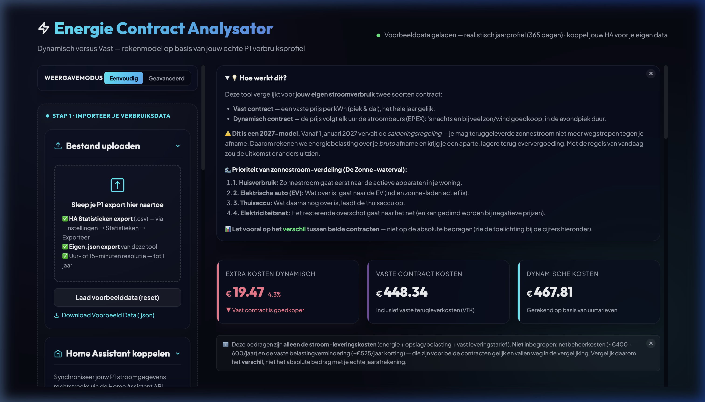
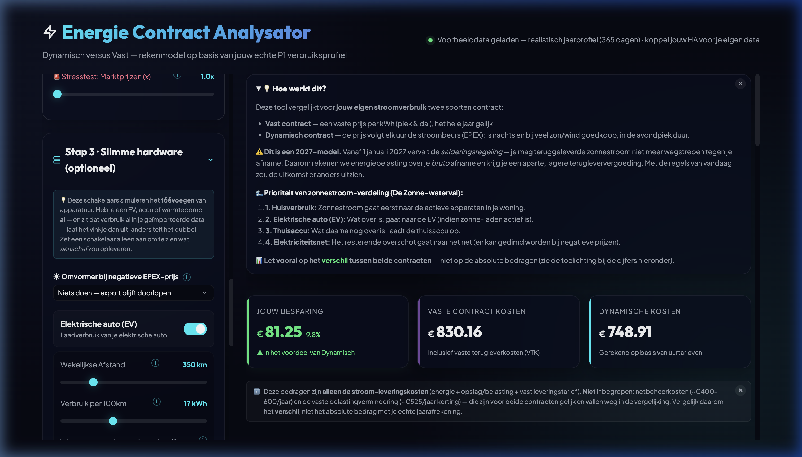
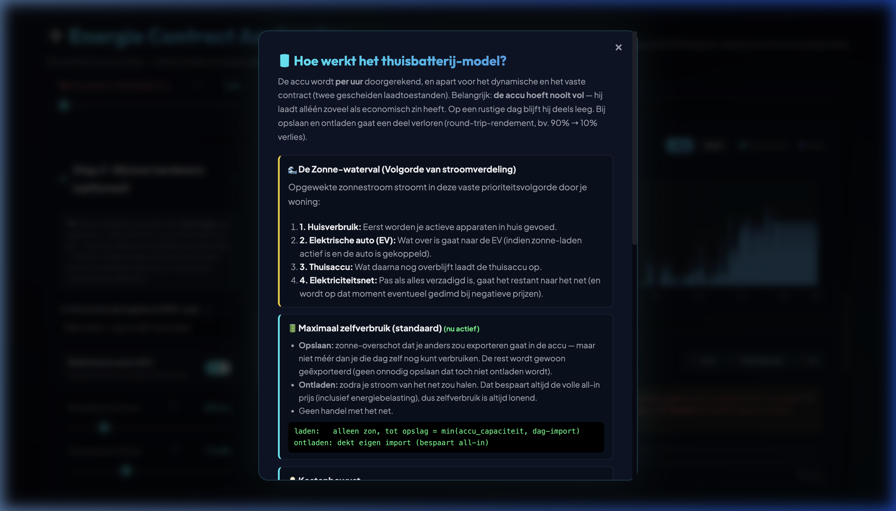
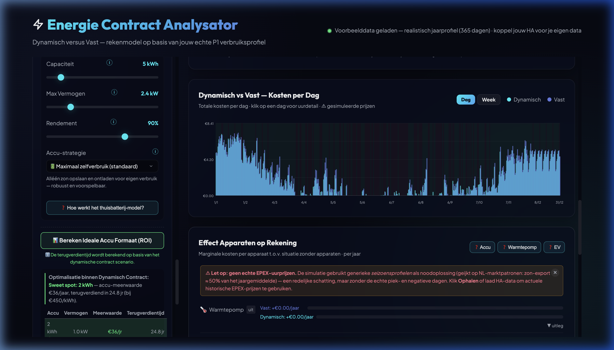

# P1 Energie Contract Analysator

> **Dynamisch vs. vast energiecontract** — bereken op basis van jouw eigen P1 smart meter data welk contract goedkoper is, gerekend met de fiscale regels van **2027** (einde saldering) of het laatste salderingsjaar **2026**.

[](#lokaal-draaien)
[](#licentie)

---

## Wat doet het?

Upload je P1-data (of koppel Home Assistant) en zie direct:

- **Jaarkosten vast vs. dynamisch** — tarieven instelbaar, leverancier-presets ingebouwd
- **Fiscaal scenario 2026/2027** — standaard het 2027-model (energiebelasting over bruto afname, geen saldering); schakel naar 2026 voor het laatste salderingsjaar (jaarverrekening, EB over netto afname). Vermindering energiebelasting en netbeheerkosten verwerkt
- **Hardware-simulaties** — warmtepomp, elektrische auto, thuisbatterij, zonnepanelen dimmen — accu-strategie rekent per scenariojaar met de juiste teruglever-economie
- **Sweet Spot Finder** — optimaal accuformaat met degradatie-gecorrigeerde terugverdientijd (~2%/jr, levensduur-check)
- **Jaarprognose** — minder dan een jaar data? Een seizoensprofiel vult de rest aan
- **Brede importsteun** — HA-statistieken (WebSocket/CSV/JSON), HomeWizard- en netbeheerder-CSV; uur- én kwartierdata (kwartieren worden per uur gesommeerd)

### Werking van de app (animatie)


### Schermafbeeldingen

| Eenvoudige weergave | Geavanceerde weergave |
|---|---|
|  |  |

| Thuisbatterij uitleg | Sweet Spot Finder |
|---|---|
|  |  |

---

## Lokaal draaien

Puur HTML/CSS/JavaScript — geen framework, geen database, geen tracking. (`npm start` bundelt de modulaire broncode automatisch met esbuild naar één `app.js`.)

### Optie 1 — npm (aanbevolen)

```bash
git clone https://github.com/cyleo/P1_dynamisch_vast_vergelijk.git
cd P1_dynamisch_vast_vergelijk
npm start          # bouwt de bundle en start op http://localhost:3000/
```

Tests draaien:
```bash
npm test
```

### Optie 2 — Python

```bash
npm install && npm run build   # eenmalig: genereert app.js (de bundle staat niet in de repo)
python3 -m http.server 8080
# open http://localhost:8080/
```

### Optie 3 — nginx (productie, bijv. energie.vulpini.nl)

```nginx
server {
    listen 443 ssl;
    server_name energie.vulpini.nl;

    root /var/www/p1-analysator;
    index index.html;

    location / {
        try_files $uri $uri/ /index.html;
    }

    # CORS voor je Home Assistant-instantie
    add_header Access-Control-Allow-Origin "https://energie.vulpini.nl" always;
    add_header Access-Control-Allow-Methods "GET, POST, OPTIONS" always;
    add_header Access-Control-Allow-Headers "Authorization, Content-Type" always;
    if ($request_method = OPTIONS) { return 204; }
}
```

**Wat zet je op de server?** Bouw eerst de bundle en kopieer dan deze bestanden/mappen naar de webroot:

```bash
npm install && npm run build
# → index.html, app.js (de zojuist gebouwde bundle), style.css, demo-year.js, assets/
```

`assets/` moet mee: de social-media-preview (`og:image`) verwijst naar `assets/geavanceerd_view.png` op je eigen domein. De mappen `src/`, `_validate/` en `docs/` zijn niet nodig op de server.

---

## Home Assistant koppelen

1. Maak een **Long-Lived Access Token** aan: *Profiel → Langdurige toegangstokens*
2. Vul in de app je HA-URL + token in en klik **Verbinden**
3. Selecteer je sensoren:
   | Rol | Voorbeeld sensor |
   |-----|-----------------|
   | Import T1 | `sensor.p1_meter_energy_import_tariff_1` |
   | Import T2 | `sensor.p1_meter_energy_import_tariff_2` |
   | Export T1 | `sensor.p1_meter_energy_export_tariff_1` |
   | Export T2 | `sensor.p1_meter_energy_export_tariff_2` |
   | Zonnepanelen (optioneel) | kWh of Wh — Wh wordt automatisch ÷1000 omgezet |
   | EV / WP / Accu (optioneel) | Activeert **Digital Twin** — strikt je bestaande hardware |
4. Kies het aantal dagen historische data (max ~730)

De app gebruikt `recorder/statistics_during_period` (uurstatistieken) — levert tot jarenlange data, in tegenstelling tot de REST history-API (max ~10 dagen).

### Beveiliging & Mixed Content (HTTPS vs HTTP)

Als deze app wordt bezocht via een beveiligde HTTPS-verbinding (zoals `https://energie.vulpini.nl`), staat de browser om veiligheidsredenen (**Mixed Content**) geen verbindingen toe naar een onbeveiligde HTTP-URL (zoals `http://homeassistant.local:8123` of lokale IP-adressen).

Om dit op te lossen zijn er drie opties:
1. **Gebruik HTTPS voor Home Assistant**: Vul je externe HTTPS-adres in (bijv. via Nabu Casa `https://xxx.ui.nabu.casa` of een eigen domein met Let's Encrypt).
2. **Draai de app lokaal**: Clone de repository en draai de app lokaal via HTTP (bijv. met `npm start` op `http://localhost:3000/`). Omdat de app dan zelf via HTTP geladen is, mag hij wel met je lokale HTTP Home Assistant verbinden.
3. **Handmatige export**: Exporteer je P1-data handmatig als CSV of JSON uit Home Assistant en upload het bestand in de app onder *Bestand uploaden*.

### Digital Twin

Koppel je eigen apparaten (laadpaal, warmtepomp, accu) om hun verbruik uit de P1-baseline te strippen. De sliders in Stap 3 modelleren daarna **vervangende** hardware (bijv. groter accuformaat). Via de knop in de banner schakel je Digital Twin uit om terug te keren naar de ruwe meterstanden.

---

## Fiscaal scenario: 2027 (standaard) of 2026

Vanaf **1 januari 2027** vervalt de salderingsregeling. Het standaard-scenario rekent daarmee:

- **Energiebelasting** over **bruto afname** — teruglevering verlaagt de EB-grondslag niet meer
- **Geen saldering** — je krijgt alleen het teruglevertarief voor teruggeleverde stroom
- **Vermindering energiebelasting (heffingskorting)** (€628,96/jaar incl. BTW, 2026-tarief) wordt van beide totalen afgetrokken
- **Netbeheerkosten** (€480,00/jaar incl. BTW, 2026-gemiddelde) worden bij beide totalen opgeteld voor een compleet beeld van de jaarrekening

Kies je **2026** (dropdown *Fiscaal scenario*, Stap 2), dan geldt de wettelijke jaarverrekening:
EB over de **netto** afname, salderbare teruglevering verrekend tegen het volle (all-in) tarief,
overschot-export tegen het teruglevertarief — en de accu-strategie rekent met die hogere
teruglever-waarde. Terugleverkosten (VTK) gaan in beide jaren over de bruto teruglevering,
zoals leveranciers ze daadwerkelijk factureren.

> ⚠️ Het EB-tarief 2027 is nog niet vastgesteld (verwacht Prinsjesdag, september 2026). De standaardwaarde is een 2026-benadering (~11,1 ct/kWh) en is instelbaar.

---

## Tarieven instellen

Kies een **leverancier-preset** bovenaan of stel handmatig in:

**Vast contract**

| Instelling | Standaard |
|------------|-----------|
| Piektarief (ma–vr 07:00–23:00) | €0,27/kWh |
| Daltarief | €0,24/kWh |
| Teruglevertarief | €0,07/kWh |
| VTK | €0,00/kWh |
| Vastrecht | €7,50/mnd |

**Dynamisch contract**

| Instelling | Standaard |
|------------|-----------|
| Inkoop-opslag boven EPEX (incl. BTW) | €0,024/kWh |
| Teruglever-opslag (incl. BTW) | €0,020/kWh |
| Vastrecht | €6,00/mnd |
| Energiebelasting | €0,111/kWh |

---

## Privacy

- Alle berekeningen draaien **lokaal in je browser** — geen P1-data naar servers
- Externe verzoeken zijn alleen: je eigen Home Assistant, en de EPEX-prijzen-API (Frank Energie / EnergyZero) bij "Ophalen"
- Geen Google Analytics, geen cookies, geen externe fonts
- Eigen meetdata (`*.json`, `*.csv`) staat in `.gitignore` en wordt niet gecommit

---

## Demo-data

De app start met een realistisch jaarprofiel (`demo-year.js`): een prosument met ~3.200 kWh verbruik en ~3.600 kWh opwek (8.760 uur).

**Bron:** [Open Power System Data — Household Data](https://data.open-power-system-data.org/household_data/), huishouden *residential4* (2017). CC-BY — *"Open Power System Data. 2020. Data Package Household Data. https://doi.org/10.25832/household_data/2020-04-15"*

---

## Technisch

- Gebouwd met modulaire ES Modules, gebundeld met `esbuild` naar één compact bestand (`app.js` in de root; door CI gegenereerd uit `src/`).
- Geen externe runtime JS-afhankelijkheden, geen externe charting-library — custom SVG-grafieken.
- Simulatie-engine (`_simulateCore`): één pure domeinfunctie, geen DOM-reads in de loop; context-gedreven (DOM-vrij, Web-Worker-klaar).
- EPEX-prijzen via Frank Energie GraphQL + EnergyZero; seizoensprofiel als fallback.
- Slider-invoer wordt gethrottled (max. ~12 zware hersimulaties/seconde) zodat het slepen vloeiend blijft.
- Automatische CI/CD workflow via Gitea Actions.
- Validatietests in `_validate/` (Node.js, `npm test`) — incl. een end-to-end slider-test die borgt dat o.a. de energiebelastingschuif de rekening daadwerkelijk beïnvloedt.

```
index.html      — UI
build.sh        — build script voor esbuild bundeling
src/            — modulaire broncode
  ├── app.js             — applicatie orchestrator (events, import, state-wiring)
  ├── domain/            — pure domeinlogica
  │   ├── constants.js   — tarieven, belastingen, fiscale jaarmodellen
  │   ├── engine.js      — simulatie-engine (_simulateCore, 8760-uurs loop)
  │   ├── energyMath.js  — simulatiemodellen (accu, EV, warmtepomp, dimmen)
  │   ├── parser.js      — Home Assistant- en CSV-parsing (uur-normalisatie)
  │   └── store.js       — centraal pub/sub state management
  └── ui/                — charts (custom SVG), modals, DOM-helpers
app.js          — gebundelde applicatie (root, gegenereerd; niet in de repo)
style.css       — styling
demo-year.js    — jaarprofiel (OPSD CC-BY)
serve.json      — lokale preview-config (SPA-fallback)
package.json    — dependencies (esbuild) en NPM scripts
_validate/      — Node.js validatietests (npm test)
.gitea/         — Gitea Actions CI/CD workflows
docs/           — engineering practices, code review, agent-taken
CLAUDE.md       — technische context voor ontwikkelaars/AI
```

---

## Licentie

MIT — vrij te gebruiken, aanpassen en verspreiden. Zie [LICENSE](LICENSE).
