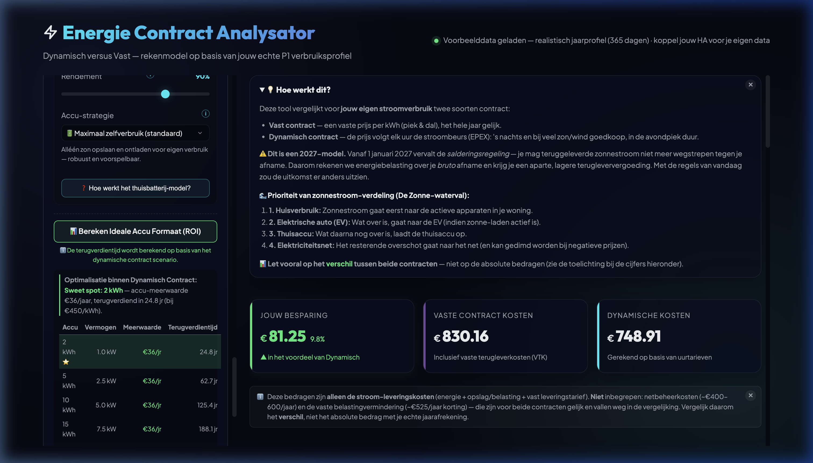
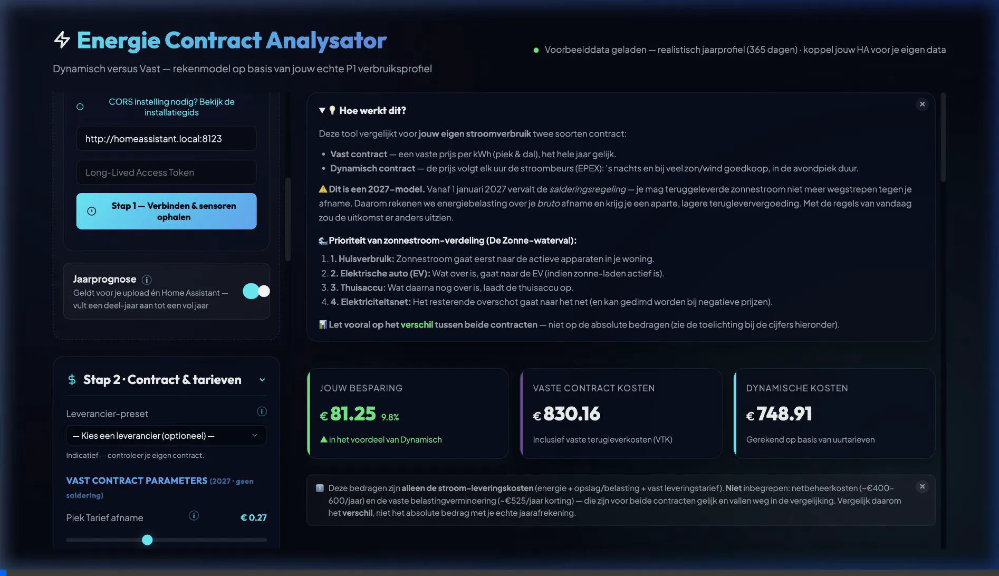

# P1 Energie Contract Analysator

> Bereken op basis van je eigen P1 smart meter data welk energiecontract goedkoper is: **vast of dynamisch** — met de fiscale regels van 2027 (geen saldering) of het laatste salderingsjaar 2026.

[](#lokaal-draaien)
[](#licentie)

---

## Hoe ziet het eruit?

| Eenvoudige weergave | Geavanceerde weergave |
|---|---|
|  |  |


---

## Wat doet het?

Laad je P1-data (of koppel Home Assistant) en de app rekent direct uit:

- **Jaarkosten vast vs. dynamisch** — tarieven vrij instelbaar, leverancier-presets ingebouwd
- **Fiscaal scenario 2026 of 2027** — kies het jaar dat voor jou geldt; het model past de energiebelasting en salderingsregels automatisch aan
- **Jaarprognose** — heb je minder dan een jaar aan data? De app vult de ontbrekende maanden aan via een seizoensprofiel
- **Brede importondersteuning** — HA-statistieken (WebSocket, CSV, JSON), HomeWizard-CSV en netbeheerder-CSV; zowel uur- als kwartierdata

### Hardware-simulaties

Voeg virtuele hardware toe en zie direct wat het je scheelt:

| Apparaat | Wat het berekent |
|---|---|
| Warmtepomp | Seizoensafhankelijk verbruik op basis van graaddagen |
| Elektrische auto | Slim laden op zonne-energie of goedkope uren |
| Thuisbatterij | Drie strategieën: zelfverbruik, kostenbewust of maximale winst |
| Zonnepanelen dimmen | Vermijdt export bij negatieve EPEX-prijzen |

### Sweet Spot Finder

De app berekent automatisch het optimale accuformaat, inclusief een degradatie-gecorrigeerde terugverdientijd.

| Batterij-uitleg | Sweet Spot Finder |
|---|---|
|  |  |



---

## Lokaal draaien

De app is puur HTML/CSS/JavaScript — geen framework, geen database, geen installatie vereist.

### Optie 1 — npm (aanbevolen voor ontwikkelaars)

```bash
git clone https://gitea.vulpini.nl/peterjan/DynOfVast.git
cd DynOfVast
npm install
npm start   # hercompileert de broncode en start op http://localhost:3000/
```

Tests draaien:

```bash
npm test
```

### Optie 2 — Python (geen installatie nodig)

`app.js` zit meegeleverd in de repository — je hoeft niets te bouwen.

```bash
git clone https://gitea.vulpini.nl/peterjan/DynOfVast.git
cd DynOfVast
python3 -m http.server 8080
# open http://localhost:8080/
```

### Optie 3 — nginx (productie)

Kopieer de volgende bestanden naar je webroot:

```
index.html  app.js  style.css  demo-year.js  assets/
```

> `assets/` is vereist: de social media preview (`og:image`) verwijst naar `assets/geavanceerd_view.png` op je eigen domein. De mappen `src/`, `_validate/` en `docs/` zijn niet nodig op de server.

Minimale nginx-configuratie:

```nginx
server {
    listen 443 ssl;
    server_name energie.vulpini.nl;

    root /var/www/p1-analysator;
    index index.html;

    location / {
        try_files $uri $uri/ /index.html;
    }

    # CORS voor je Home Assistant-instantie
    add_header Access-Control-Allow-Origin "https://energie.vulpini.nl" always;
    add_header Access-Control-Allow-Methods "GET, POST, OPTIONS" always;
    add_header Access-Control-Allow-Headers "Authorization, Content-Type" always;
    if ($request_method = OPTIONS) { return 204; }
}
```

---

## Home Assistant koppelen

1. Maak een **Long-Lived Access Token** aan via *Profiel → Langdurige toegangstokens*
2. Vul in de app je HA-URL en token in en klik op **Verbinden**
3. Koppel je sensoren:

   | Rol | Voorbeeldnaam |
   |---|---|
   | Import T1 | `sensor.p1_meter_energy_import_tariff_1` |
   | Import T2 | `sensor.p1_meter_energy_import_tariff_2` |
   | Export T1 | `sensor.p1_meter_energy_export_tariff_1` |
   | Export T2 | `sensor.p1_meter_energy_export_tariff_2` |
   | Zonnepanelen (optioneel) | kWh of Wh — Wh wordt automatisch omgezet |
   | EV / WP / Accu (optioneel) | activeert Digital Twin |

4. Kies het aantal dagen historische data (maximaal ~730 dagen)

De app gebruikt de WebSocket-API `recorder/statistics_during_period` voor uurstatistieken. Dit levert tot jarenlange meetdata op — de REST history-API geeft maximaal ~10 dagen terug.

### HTTPS vs. HTTP (Mixed Content)

Gebruik je de app via `https://` maar draait je Home Assistant op een lokaal HTTP-adres? Dan blokkeert de browser de verbinding vanwege Mixed Content. Er zijn drie oplossingen:

1. **HTTPS voor Home Assistant** — gebruik je externe adres, bijvoorbeeld via Nabu Casa (`https://xxx.ui.nabu.casa`) of een eigen domein met Let's Encrypt
2. **App lokaal draaien** — kloon de repository en open de app via `http://localhost:3000/`; een HTTP-app mag wel verbinding maken met een lokale HTTP-instantie
3. **Handmatige export** — exporteer je P1-data als CSV of JSON vanuit Home Assistant en upload het bestand in de app

### Digital Twin

Heb je al een laadpaal, warmtepomp of thuisbatterij? Koppel de bijbehorende sensoren en de app filtert hun verbruik uit de P1-baseline. De sliders in Stap 3 modelleren daarna **vervangende** hardware, zodat je bijvoorbeeld kunt uitrekenen wat een groter accuformaat zou schelen.

---

## Fiscaal scenario: 2026 of 2027

Kies het jaar dat op jou van toepassing is via het dropdown-menu in Stap 2.

**2027 (standaard)** — de salderingsregeling is afgelopen:
- Energiebelasting over **bruto afname** (teruglevering verlaagt de grondslag niet)
- Je ontvangt alleen het teruglevertarief voor stroom die je teruggeeft

**2026** — het laatste salderingsjaar:
- Energiebelasting over **netto afname** (import min export)
- Salderbare teruglevering wordt verrekend tegen het volledige (all-in) importtarief
- Overschot boven je jaarafname krijgt het teruglevertarief

In beide scenario's worden de **vermindering energiebelasting** (€628,96/jaar incl. BTW) en **netbeheerkosten** (€480,00/jaar incl. BTW, gemiddelde 2026) meegenomen — vergelijking-neutraal, maar zo klopt de absolute jaarrekening.

> Het EB-tarief voor 2027 is nog niet vastgesteld (verwacht Prinsjesdag, september 2026). De standaardwaarde is een 2026-benadering (~11,1 ct/kWh) en is vrij instelbaar.

---

## Tarieven instellen

Kies een **leverancier-preset** bovenaan Stap 2, of stel handmatig in:

**Vast contract**

| Instelling | Standaard |
|---|---|
| Piektarief (ma–vr 07:00–23:00) | €0,27/kWh |
| Daltarief | €0,24/kWh |
| Teruglevertarief | €0,07/kWh |
| Terugleverkosten (VTK) | €0,00/kWh |
| Vastrecht | €7,50/mnd |

**Dynamisch contract**

| Instelling | Standaard |
|---|---|
| Inkoop-opslag boven EPEX (incl. BTW) | €0,024/kWh |
| Teruglever-opslag (incl. BTW) | €0,020/kWh |
| Vastrecht | €6,00/mnd |
| Energiebelasting | €0,111/kWh |

EPEX-spotprijzen worden automatisch opgehaald via Frank Energie en EnergyZero. Als er geen live data beschikbaar is, valt de app terug op een zelf-kalibrerend seizoensprofiel gebaseerd op je eigen historische data.

---

## Privacy

- Alle berekeningen worden **lokaal in je browser** uitgevoerd — je P1-data verlaat je apparaat niet
- Externe verzoeken gaan uitsluitend naar je eigen Home Assistant en de EPEX-prijzen-API (Frank Energie / EnergyZero) bij het ophalen van spotprijzen
- Geen analytics, geen cookies, geen externe lettertypes
- Persoonlijke meetdata (`*.json`, `*.csv`) staat in `.gitignore` en wordt nooit gecommit

---

## Demo-data

De app start met een realistisch jaarprofiel van een prosument: ~3.200 kWh verbruik en ~3.600 kWh zonne-opwek (8.760 uur).

**Bron:** [Open Power System Data — Household Data](https://data.open-power-system-data.org/household_data/), huishouden *residential4* (2017). Licentie CC-BY:

> *"Open Power System Data. 2020. Data Package Household Data. https://doi.org/10.25832/household_data/2020-04-15"*

---

## Technisch

Gebouwd met modulaire ES Modules, gebundeld met [esbuild](https://esbuild.github.io/) naar één compact bestand. Geen externe runtime-afhankelijkheden, geen charting-library — alle grafieken zijn custom SVG.

```
index.html        — UI
src/
  ├── app.js           — applicatie-orchestrator (events, import, state)
  ├── domain/
  │   ├── constants.js — tarieven, belastingen, fiscale jaarmodellen
  │   ├── engine.js    — simulatie-engine (_simulateCore, 8760-uurs loop)
  │   ├── energyMath.js — accu, EV, warmtepomp, dimmen
  │   ├── parser.js    — HA- en CSV-parsing, uur-normalisatie
  │   └── store.js     — centraal pub/sub state management
  └── ui/              — charts (custom SVG), modals, DOM-helpers
app.js            — gebundelde applicatie (meegeleverd in de repo)
style.css         — styling
demo-year.js      — jaarprofiel (OPSD CC-BY)
package.json      — esbuild + NPM scripts
_validate/        — validatietests (npm test)
.gitea/           — CI/CD workflows (Gitea Actions)
```

---

## Licentie

MIT — vrij te gebruiken, aanpassen en verspreiden. Zie [LICENSE](LICENSE).
